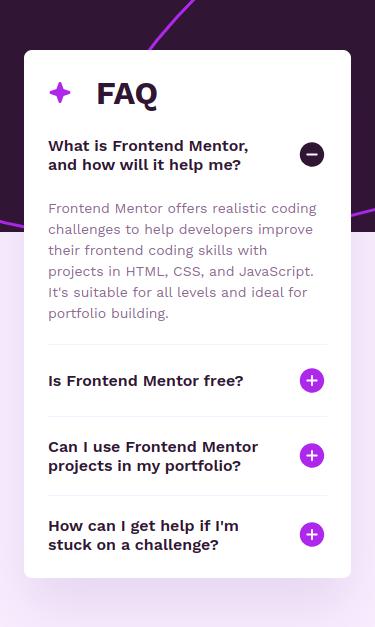
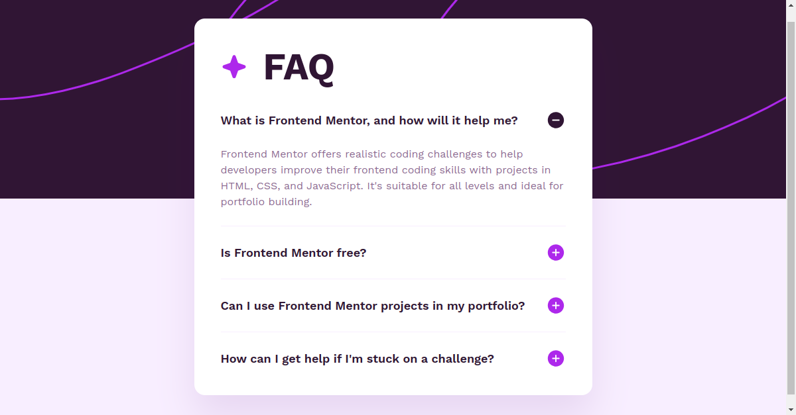

# Frontend Mentor | FAQ Accordion

This is my solution to the [FAQ Accordion challenge](https://www.frontendmentor.io/challenges/faq-accordion-wyfFdeBwBz)
from [Frontend Mentor](https://www.frontendmentor.io/).

## Tech Stack

### Frontend

- **Framework**: [Next.js](https://nextjs.org/)
- **UI Library**: [Radix UI](https://www.radix-ui.com/)
- **Style**: [Tailwind CSS](https://tailwindcss.com/)

### Backend

- **CDN**: Static assets served from [Vercel Edge Network](https://vercel.com/docs/edge-network/overview).

## Dev Environment & Tools

- System: [Ubuntu 24](https://ubuntu.com/desktop)
- IDE: [WebStorm](https://www.jetbrains.com/webstorm/)
- Formatter: [Prettier](https://prettier.io/)
- Linter: [ESLint](https://eslint.org/)
- AI assistant: [GitHub Copilot](https://github.com/features/copilot)

## Screenshots

### Mobile Home Page

### Desktop Home Page

## Copyright

© 2024 Johnny Gérard
