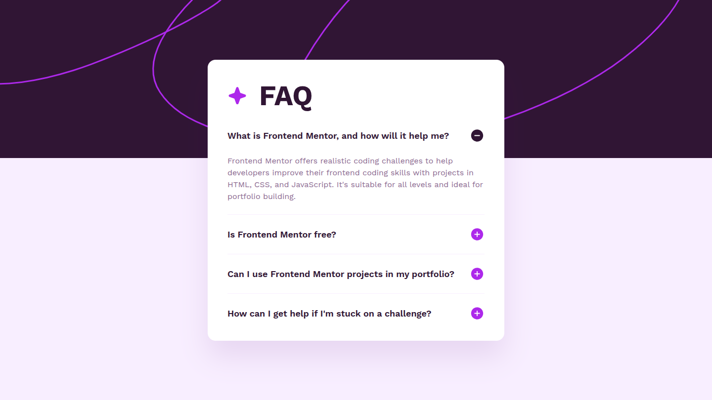

# Frontend Mentor | FAQ Accordion

This is my solution to the [FAQ Accordion challenge](https://www.frontendmentor.io/challenges/faq-accordion-wyfFdeBwBz)
from [Frontend Mentor](https://www.frontendmentor.io/).

[](https://www.frontendmentor.io/solutions/faq-accordion-3bNxpis7V3)
[](https://fem-faq-accordion-jgerard.vercel.app/)
[](https://googlechrome.github.io/lighthouse/viewer/?gist=61b7bb01a869e3a5722d987545ebc767)

## Tech Stack

### Frontend

- **UI library**: [React 19](https://react.dev/)
- **Framework**: [Next.js 16](https://nextjs.org/)
- **Headless UI library**: [Radix UI](https://www.radix-ui.com/primitives)
- **Styling**: [Tailwind CSS 4](https://tailwindcss.com/)

### Backend

- **CDN**: [Vercel](https://vercel.com/docs/cdn)

## How to Update

To check for outdated packages, run `npm outdated`.

```bash
# Update dependencies (this will rewrite package-lock.json and package.json)
npm update --save
npm install --save-exact --save-dev prettier@latest prettier-plugin-tailwindcss@latest
```

## Dev Environment & Tools

- **System**: [Ubuntu](https://ubuntu.com/desktop)
- **Editor**: [VS Code](https://code.visualstudio.com/)
- **Formatter**: [Prettier](https://prettier.io/)
- **Linter**: [ESLint](https://eslint.org/)
- **AI assistant**: [GitHub Copilot](https://github.com/features/copilot)

## Screenshots

### Mobile Home Page


### Desktop Home Page



## Copyright

© 2025 Johnny Gérard
